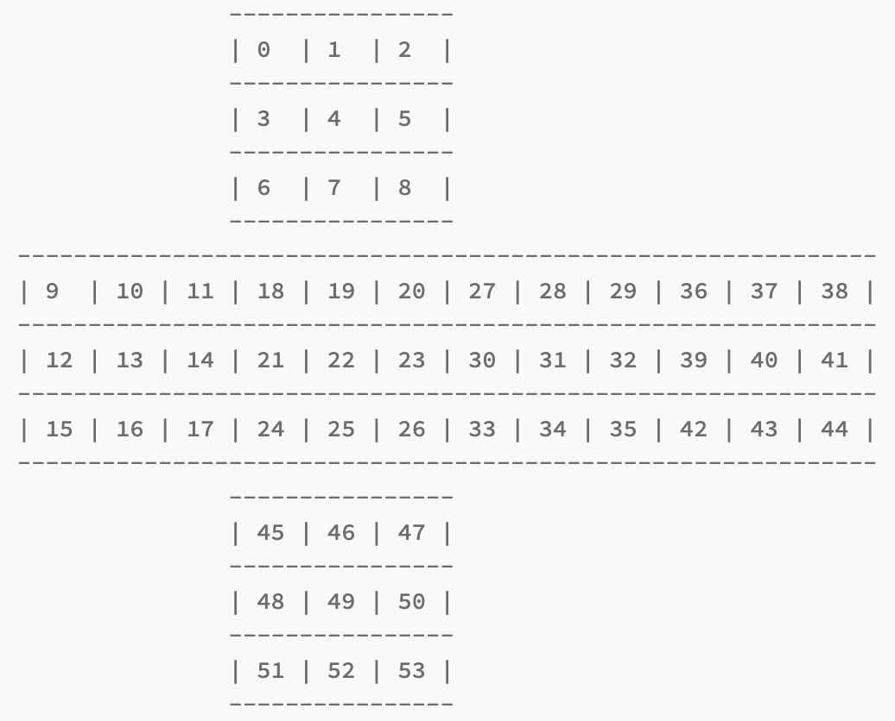

# rubiks-cube-solver
This is a C program that solves a Rubik's Cube.

### Inputs
The user enters a string into the terminal which coresponds to the colors on each square of a Rubiks cube. The string is a series of single letter color abbreiviations. The abbreviations are:

- White: w
- Yellow: y
- Orange: o
- Red: r
- Blue: b
- Green: g

The order in which each square color abbreviation appears in the input string matters, as each abbreviation corresponds to a spesific square on the Rubik's cube. The order in which the abbreviations appear in the string should correspond to:

 

This is the input string for a completed cube: "wwwwwwwwwgggggggggrrrrrrrrrbbbbbbbbboooooooooyyyyyyyyy"
 
This is a input string for a mixed up cube: "wowgybwyogygybyoggrowbrgywrborwggybrbwororbwborgowryby"

### Outputs
The program outputs the steps required to complete the cube.
