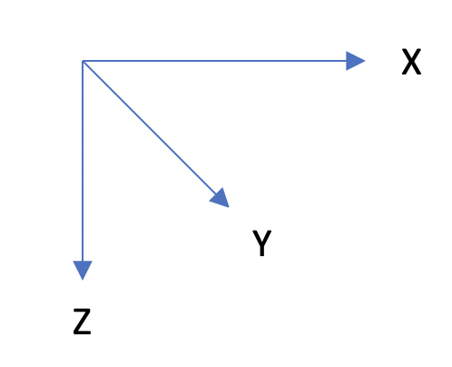

# rubiks-cube-solver
This is a C program that solves a Rubik's Cube.

## Usage
### Inputs
The user enters a string into the terminal which coresponds to the colors on each square of a Rubiks cube. The string is a series of single letter color abbreiviations. The abbreviations are:

- White: w
- Yellow: y
- Orange: o
- Red: r
- Blue: b
- Green: g

The order in which each square color abbreviation appears in the input string matters, as each abbreviation corresponds to a spesific square on the Rubik's cube. The order in which the abbreviations appear in the string should correspond to:

 

This is the input string for a completed cube: "wwwwwwwwwgggggggggrrrrrrrrrbbbbbbbbboooooooooyyyyyyyyy"
 
This is a input string for a mixed up cube: "wowgybwyogygybyoggrowbrgywrborwggybrbwororbwborgowryby"

### Outputs
The program outputs two files which both include instructions to solve a Rubik's cube of the user entered permutation. The first file, 'instr.txt', holds the initialy optimized instructions. The second file, 'instr2.txt', holds further optimized instructions that the first optimization processed missed. Each instruction indicates a face to rotate and the direction of rotation. Clockwise and counterclockwise rotations are taken as a rotation of the face if it were directly facing the user. The instructions are presented as follows:

- R: rotate the right face in the clockwise direction
- r: rotate the right face in the counterclockwise direction
- L: rotate the left face in the clockwise direction
- l: rotate the left face in the counterclockwise direction
- F: rotate the front face in the clockwise direction
- f: rotate the front face in the counterclockwise direction
- B: rotate the back face in the clockwise direction
- b: rotate the back face in the counterclockwise direction
- U: rotate the top face in the clockwise direction
- u: rotate the top face in the counterclockwise direction
- D: rotate the bottom face in the clockwise direction
- d: rotate the bottom face in the counterclockwise direction
- X: rotate the cube around the X axis in the clockwise direction
- x: rotate the cube around the X axis in the counterclockwise direction
- Y: rotate the cube around the Y axis in the clockwise direction
- y: rotate the cube around the y axis in the counterclockwise direction
- Z: rotate the cube around the Z axis in the clockwise direction
- z: rotate the cube around the z axis in the counterclockwise direction

The cube axis are defined as follows:

